# Command Center 40K

A desktop companion for Warhammer 40,000 (11th edition). Drop in two army lists and it helps you
answer the questions that come up before and during a game: *what does this unit actually do to
that one? Who should shoot what? Where do I deploy? How is this mission going to score? And
what's the score right now?*

It runs on your own computer, fetches its rules data from Wahapedia by itself, and remembers
your work between sessions.

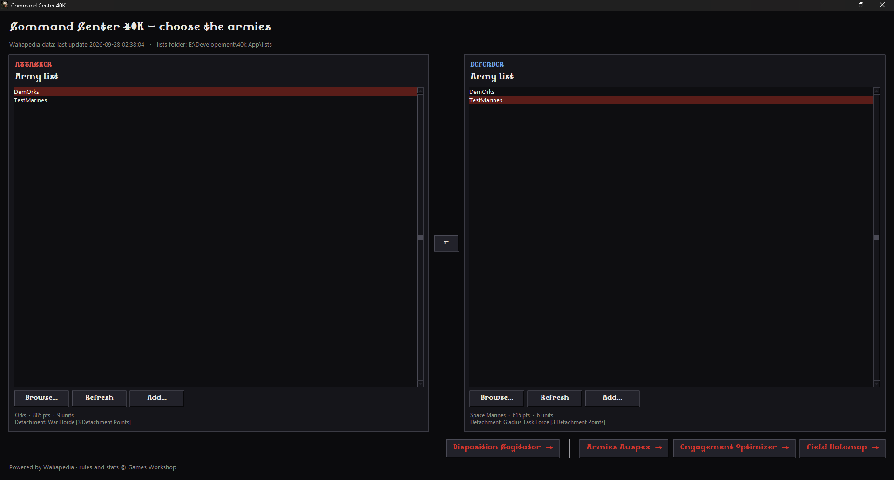

## Getting started

**On Windows, nothing to install:** download `CommandCenter40K-windows.zip` from the
[latest release](https://github.com/ErestorX/CommandCenter40K/releases/latest), unzip it where
you like and double-click `Command Center 40K.exe`. Windows may warn about an unknown
publisher the first time: **More info**, then **Run anyway**. Your lists and saved work stay in
that folder.

**On a Mac (Apple Silicon), nothing to install either:** download `CommandCenter40K-macos.zip`
from the same page, unzip it and move `Command Center 40K` to your Applications folder. The app
isn't signed with an Apple developer certificate, so macOS refuses to open it the first time:
open **System Settings › Privacy & Security**, scroll down and click **Open Anyway**. Your lists
and saved work are in `~/Library/Application Support/Command Center 40K`.

On both, when a new version is out, the app offers to install it at start-up (it checks once a
day): say yes and it comes back updated, with your lists and saved work as they were.

**From the source:** you need a recent Python 3 (it is developed on 3.14; tkinter, which it
uses, ships with Python on Windows).

```bash
pip install -r requirements.txt
python main.py                 # or double-click run_app.bat
```

The app comes with two small demonstration lists, DemOrks and TestMarines, and with work
already saved for them (Optimizer tests, an army plan, Estimates), so every tool has something
to show straight away.

The first time it starts, the app downloads what it needs from Wahapedia: give it a minute.
After that it checks for new data once a day at start-up, and simply carries on with what it
has if you are offline.

### Bringing your lists in

Lists come from [NewRecruit](https://www.newrecruit.eu). In the launcher, click **Add...** and
follow the note in the dialog:

1. In NewRecruit, when the list is finished, click **Export**, then **Text export**
2. Export Format: **NR**
3. Tick all the Content options
4. **Copy to clipboard**, paste it in the dialog, and give the list a new name

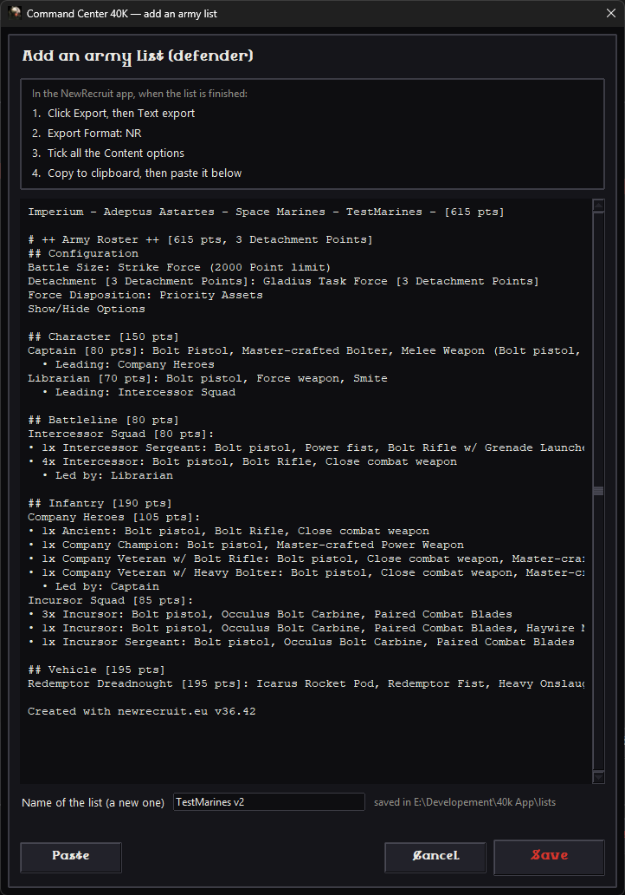

The list is saved next to the others (in `lists/`) and selected straight away. Pick an attacker
and a defender, the **⇄** button swaps them, then choose a tool.

One thing worth knowing: the mission tools read the `Force Disposition:` line of your list
(Take and Hold, Purge the Foe, Disruption, Reconnaissance or Priority Assets), so make sure
NewRecruit exports it.

## The tools

### Armies Auspex - one unit against another

Pick a unit on each side and see what happens when one attacks the other: the damage to
expect, the models it kills, the odds of wiping the unit out, and the whole spread of outcomes
rather than just an average.

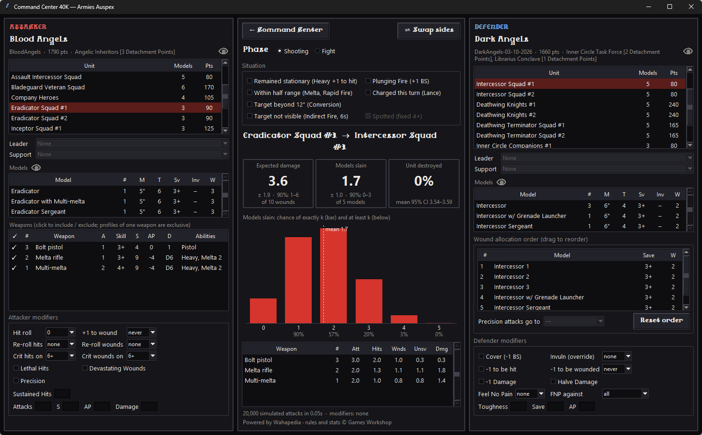

- Add the Leader or Support character that joins the unit, switch between Shooting and Fight.
- Tick the situation (stood still, half range, in cover...) and any buff or debuff: +1 to hit,
  re-rolls, Lethal Hits, Feel No Pain... The numbers update as you tick.
- Untick weapons you wouldn't fire, and drag the defender's models to change who takes the
  wounds first.
- The little eye icons open the army's rules and stratagems, or a unit's abilities.

### Engagement Optimizer - every unit against every unit

The Auspex, for whole armies. Tick the units you care about, give each a few "tests" (a
combination of modifiers: *re-roll 1s and Lethal Hits*, *in cover with a 5+ Feel No Pain*...),
press **Cogitate**, and it plays every attacker test against every defender test.

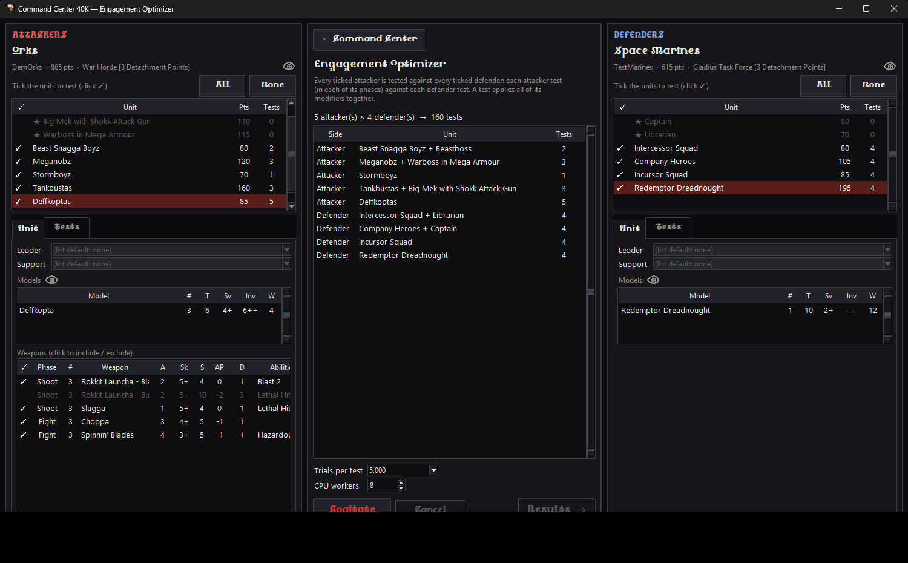

The results window then answers the practical questions:

- **Army plan**: a first and a second target for each of your units, so that every enemy unit
  is dealt with and nothing is wasted on overkill. A slider says whether you care more about
  wounds or about points removed.
- **Matrix**: your units down the side, theirs across the top, one glance for the good and the
  bad matchups. Click a cell for the detail.
- **Best attackers into... / Best targets for...**: the rankings, as bars.

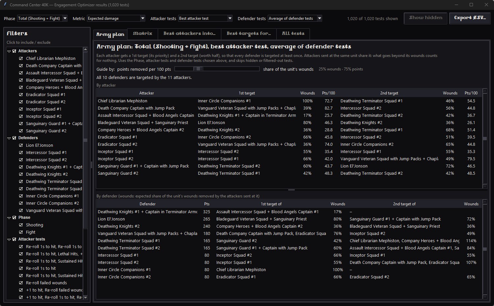

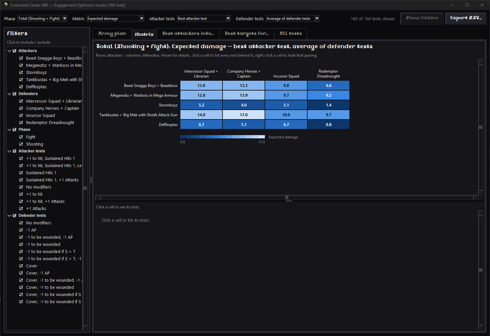

Your tests are remembered for each list, and the army plan is saved too: the Field Holomap
uses it to draw who is aiming at whom.

### Field Holomap - the table, before the game

Shows the primary mission each player gets from the two Force Dispositions, and the three
battlefield layouts of that matchup with their deployment zones, terrain and objectives.

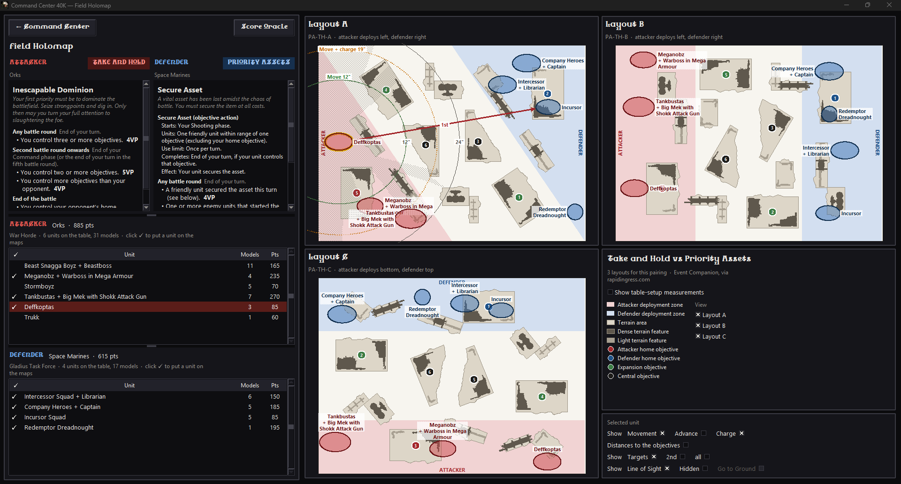

- Tick a unit in the roster to drop it on the boards, then drag it where you want it. Double
  click turns it.
- Select a unit and switch on what you want to see around it: how far it moves, advances and
  charges, its distance to each objective, its line of sight and weapon ranges, and the
  targets the Optimizer planned for it.
- Only interested in one layout? Untick the others next to the legend and the boards left
  take all the room.

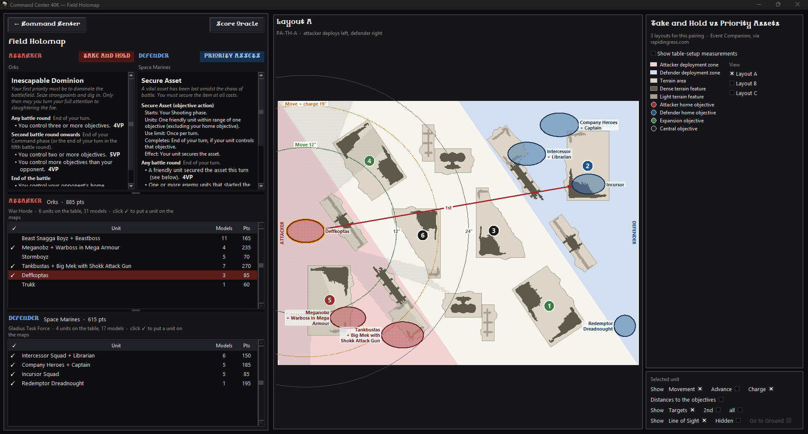

### Score Oracle - the score sheet

Opens from the Field Holomap and stays next to it during the game.

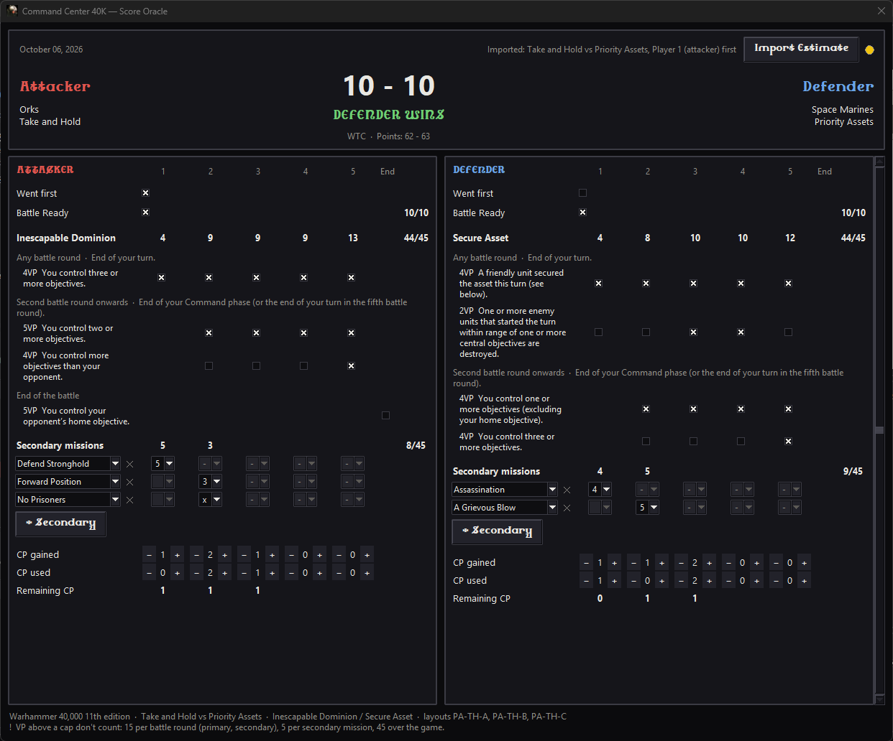

- The primary mission is laid out line by line, as on its card: tick what you scored each
  round, or count with **- +** when it scores "for each...". No mental arithmetic.
- **+ Secondary** draws a secondary mission you haven't had yet; pick the points from the
  drop-down, or **x** when you discard it.
- It knows the caps (15 points a round, 5 per secondary, 45 over the game). You can still enter
  more: a **!** shows where points are going to waste.
- Command points gained and used per round, with what you have left.
- The result at the top is the WTC 20-0 score.

### Disposition Cogitator - thinking about matchups

This one needs no list. It lays out every Force Disposition against every other, with the
primary mission each side plays.

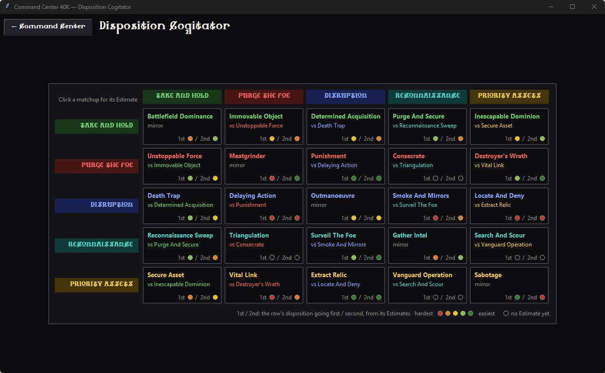

Click a matchup to open its **Estimate**: the two primary missions side by side, where you
tick how you expect the game to go round by round, above the three layouts of that matchup.

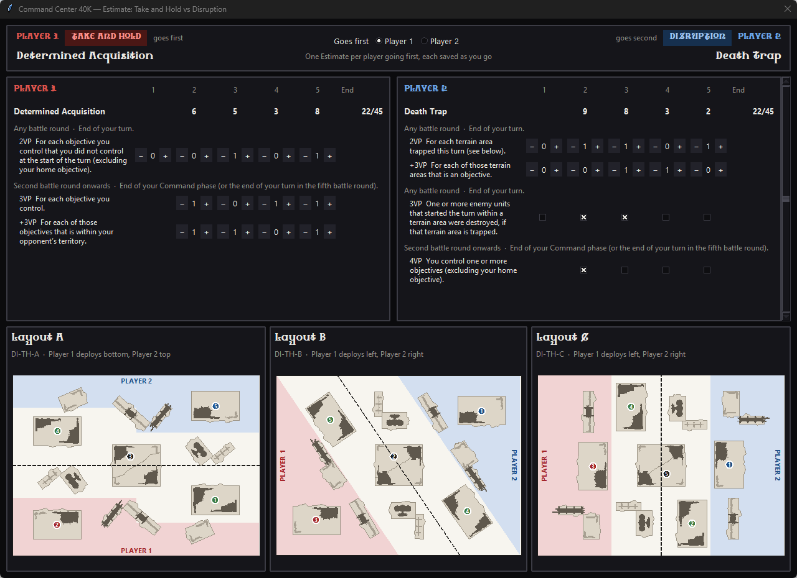

- There is an Estimate for each player going first: switch at the top of the window.
- Everything is saved as you go, and the circles on the matrix colour themselves from your
  Estimates, from red (your hardest matchups) to green (the easiest).
- On game day, **Import Estimate** in the Score Oracle fills the score sheet with the Estimate
  of the matchup you are actually playing.

## Good to know

- Nothing leaves your computer: lists are in `lists/`, your saved work in `user_data/` (on a Mac,
  both in `~/Library/Application Support/Command Center 40K`).
- The numbers come from a simulation (thousands of dice rolls per matchup), so they are very
  close to the true odds but can move by a decimal from one run to the next.
- Not every special rule is simulated: when a unit has an ability the app doesn't model, the
  Auspex lists it at the bottom of that army's panel.
- Each tool has a **← Command Center** button to come back and pick other lists.

Curious about how it works, or want to add a tool? The technical notes are in
[command_center/README.md](command_center/README.md).

## Credits

Powered by [Wahapedia](https://wahapedia.ru); battlefield layouts from the Event Companion via
[Rapid Ingress](https://rapidingress.com). Rules, names and stats are © Games Workshop. This is
a fan-made tool, not affiliated with Games Workshop.
